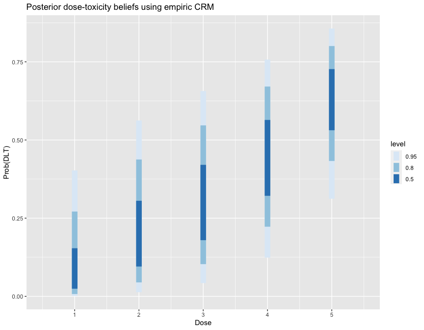
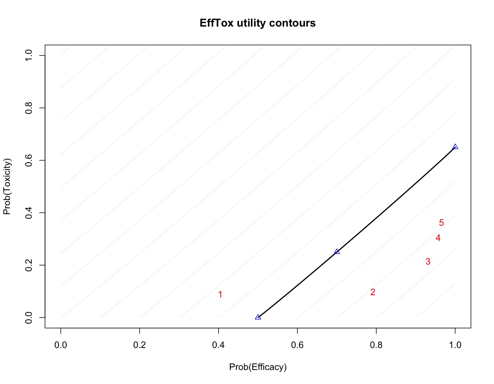
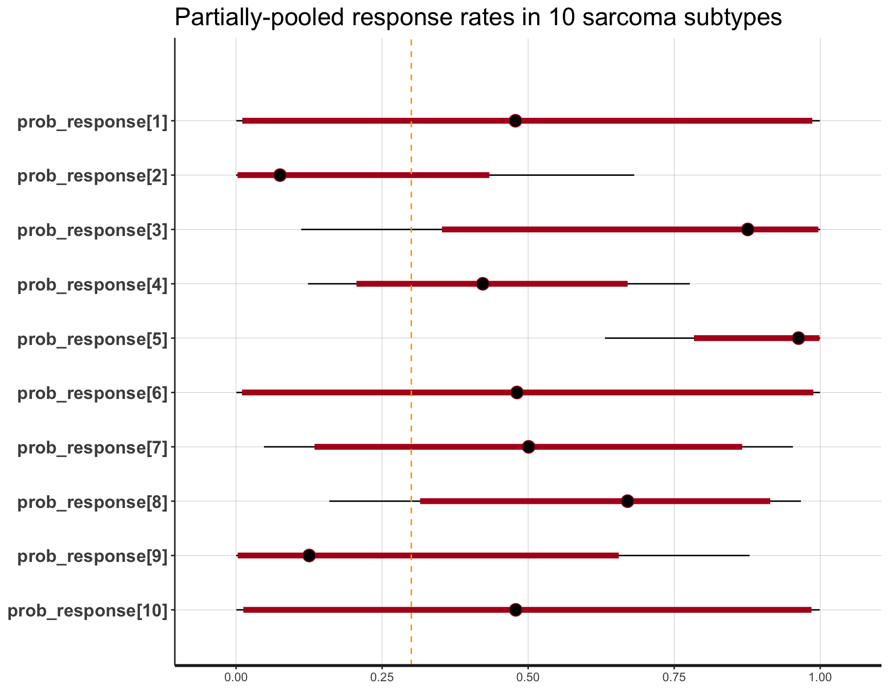

trialr - Clinical Trial Designs in `RStan`
================
Kritian Brock

<!-- README.md is generated from README.Rmd. Please edit that file -->

# trialr

[](https://cran.r-project.org/web/packages/trialr)

<https://cranlogs.r-pkg.org/badges/trialr>

<https://cranlogs.r-pkg.org/badges/grand-total/trialr>

`trialr` is a collection of Bayesian clinical trial designs implemented
in Stan and R. The documentation is available at
<https://brockk.github.io/trialr/>

There are many notable Bayesian designs and methods for clinical trials.
However, one of the factors that has constrained their use is the
availability of software. We present here some of the most popular,
implemented and demonstrated in a consistent style, leveraging the
powerful Stan environment for Bayesian computing.

Implementations exist in other R packages. Sometimes authors make
available code with their publications. However, challenges to use still
persist. Different methods are presented in disparate styles. Features
implemented in one package for one design may be missing in another.
Sometimes the technology chosen may only be available on a particular
operating system, or the chosen technology may have fallen into disuse.

`trialr` seeks to address these problems. Models are specified in
[Stan](http://mc-stan.org/), a state-of-the-art environment for Bayesian
analysis. It uses Hamiltonian Monte Carlo to take samples from the
posterior distribution. This method is more efficient than Gibbs
sampling and reliable inference can usually be performed on a few
thousand posterior samples. R, Stan and `trialr` are each available on
Mac, Linux, and Windows, so all of the examples presented here work on
each operating system. Furthermore, Stan offers a very simple method to
split the sampling across *n* cores, taking full advantage of the modern
multicore processors.

The designs implemented in `trialr` are introduced briefly below, and
developed more fully in vignettes. We focus on real-life usage,
including:

  - fitting models to observed data;
  - processing posterior samples using tidy principles to produce useful
    inferences;
  - and visualising inferences using modern `ggplot` graphics.

# Examples

In all examples, we will need to load `trialr`

``` r
library(trialr)
```

## CRM

The Continual Reassessment Method (CRM) was first published by
O’Quigley, Pepe, and Fisher (1990). It assumes a smooth mathematical
form for the dose-toxicity curve to conduct a dose-finding trial seeking
a maximum tolerable dose. There are many variations to suit different
clinical scenarios and the design has enjoyed relatively common use,
although nowhere near as common as the ubiquitous and inferior 3+3
design.

We will demonstrate the method using a notional trial example. In a
scenario of five doses, we seek the dose with probability of toxicity
closest to 25% where our prior guesses of the rates of toxicity can be
represented:

``` r
target <- 0.25
skeleton <- c(0.05, 0.15, 0.25, 0.4, 0.6)
```

Let us assume that we have already treated 2 patients each at doses 2, 3
and 4, having seen two toxicities at dose-level 4 and none elsewhere.
What dose should we give to the next patient or cohort? We fit the data
to the popular empiric variant of the CRM model:

``` r
fit1 <- stan_crm(outcome_str = '2NN 3NN 4TT', skeleton = skeleton, 
                 target = target, model = 'empiric', beta_sd = sqrt(1.34), 
                 seed = 123)
```

The parameter `outcome_str = '2NN 3NN 4TT'` reflects that two patients
each have been treated at doses 2, 3, and 4, and that the two patients
at dose 4 had toxicity but the other patients did not.

The fitted model contains lots of useful of information:

``` r
fit1
#>   Patient Dose Toxicity Weight
#> 1       1    2        0      1
#> 2       2    2        0      1
#> 3       3    3        0      1
#> 4       4    3        0      1
#> 5       5    4        1      1
#> 6       6    4        1      1
#> 
#>   Dose Skeleton N Tox ProbTox MedianProbTox ProbMTD
#> 1    1     0.05 0   0   0.108        0.0726  0.2140
#> 2    2     0.15 2   0   0.216        0.1900  0.2717
#> 3    3     0.25 2   0   0.310        0.2972  0.2657
#> 4    4     0.40 2   2   0.444        0.4484  0.2090
#> 5    5     0.60 0   0   0.624        0.6395  0.0395
#> 
#> The model targets a toxicity level of 0.25.
#> The dose with estimated toxicity probability closest to target is 2.
#> The dose most likely to be the MTD is 2.
#> Model entropy: 1.49
```

``` r
library(ggplot2)
library(tidybayes)
library(dplyr)

fit1 %>% 
  spread_draws(prob_tox[Dose]) %>% 
  ggplot(aes(x = Dose, y = prob_tox)) +
  stat_interval(.width = c(.5, .8, .95)) +
  scale_color_brewer() + 
  labs(y = 'Prob(DLT)', title = 'Posterior dose-toxicity beliefs using empiric CRM')
```

<!-- -->

Several variants of the CRM [are implemented in
‘trialr’](articles/CRM.html). Further visualisation techniques are
demonstrated in the [Visualisation in
CRM](articles/CRM-visualisation.html) vignette. The time-to-event CRM is
introduced in the [TITE-CRM vignette](articles/TITE-CRM.html).

## EffTox

EffTox by Thall and Cook (2004) is a dose-finding design that uses
binary efficacy and toxicity outcomes to select a dose with a high
utility score. We present it briefly here but there is a much more
thorough examination in the [EffTox vignette](articles/EffTox.html).

For demonstration, we fit the model parameterisation introduced by Thall
et al. (2014) to the following notional outcomes:

| Patient | Dose-level | Toxicity | Efficacy |
| :-----: | :--------: | :------: | :------: |
|    1    |     1      |    0     |    0     |
|    2    |     1      |    0     |    0     |
|    3    |     1      |    0     |    1     |
|    4    |     2      |    0     |    1     |
|    5    |     2      |    0     |    1     |
|    6    |     2      |    1     |    1     |

``` r
outcomes <- '1NNE 2EEB'
fit2 <- stan_efftox_demo(outcomes, seed = 123)
```

In an efficacy and toxicity dose-finding scenario, the number of patient
outcomes has increased. It is possible that patients experience efficacy
only (E), toxicity only (T), both (B) or neither (N).

``` r
fit2
#>   Patient Dose Toxicity Efficacy
#> 1       1    1        0        0
#> 2       2    1        0        0
#> 3       3    1        0        1
#> 4       4    2        0        1
#> 5       5    2        0        1
#> 6       6    2        1        1
#> 
#>   Dose N ProbEff ProbTox ProbAccEff ProbAccTox Utility Acceptable ProbOBD
#> 1    1 3   0.405  0.0899      0.332      0.927  -0.340       TRUE  0.0400
#> 2    2 3   0.792  0.0988      0.946      0.922   0.424       TRUE  0.2512
#> 3    3 0   0.931  0.2152      0.985      0.729   0.525       TRUE  0.2065
#> 4    4 0   0.957  0.3061      0.985      0.629   0.438      FALSE  0.0622
#> 5    5 0   0.966  0.3626      0.984      0.577   0.369      FALSE  0.4400
#> 
#> The model recommends selecting dose-level 3.
#> The dose most likely to be the OBD is 5.
#> Model entropy: 1.34
```

In this example, after evaluation of our six patients, the dose
advocated for the next group is dose-level 3. This is contained in the
fitted object:

``` r
fit2$recommended_dose
#> [1] 3
```

This is not surprising because dose 3 has the highest utility score:

``` r
fit2$utility
#> [1] -0.3397885  0.4237935  0.5249445  0.4380717  0.3685257
```

Sometimes, doses other than the maximal-utility dose will be recommended
because of the dose-admissibility rules. See the
[vignette](articles/EffTox.html) and the original papers for more
details.

Functions are provided to create useful plots. For instance, it is
illuminating to plot the posterior means of the probabilities of
efficacy and toxicity at each of the doses on the trade-off contours
used to measure dose attractiveness. The five doses are shown in red.
Doses closer to the lower-right corner have higher utility.

``` r
efftox_contour_plot(fit2)
title('EffTox utility contours')
```

<!-- -->

This example continues in the [EffTox vignette](articles/EffTox.html).

There are many publications related to EffTox, including Thall and Cook
(2004) and Thall et al. (2014).

## Hierachical analysis of response in related cohorts

Sticking with Peter Thall’s huge contribution to Bayesian clinical
trials, Thall et al. (2003) described a method for analysing treatment
effects of a single intervention in several sub-types of a single
disease.

We demonstrate the method for partially-pooling response rates to a
single drug in various subtypes of sarcoma. This example is used in
Thall et al. (2003). Fitting the data to the model:

``` r
fit3 <- stan_hierarchical_response_thall(
  group_responses = c(0, 0, 1, 3, 5, 0, 1, 2, 0, 0), 
  group_sizes = c(0, 2 ,1, 7, 5, 0, 2, 3, 1, 0), 
  mu_mean = -1.3863,
  mu_sd = sqrt(1 / 0.1),
  tau_alpha = 2,
  tau_beta = 20)
```

`mu` and `tau` are mean and precision parameters for the
partially-pooled effects in the model. `mu_mean` and `mu_sd` are
hyperparameters for a normal prior, and `tau_alpha` and `tau_beta` are
hyperparameters for an inverse gamma prior. This specification is
described in the original model.

The returned object is the same type as the fits returned by rstan:

``` r
fit3
#> Inference for Stan model: ThallHierarchicalBinary.
#> 4 chains, each with iter=2000; warmup=1000; thin=1; 
#> post-warmup draws per chain=1000, total post-warmup draws=4000.
#> 
#>                     mean se_mean    sd   2.5%    25%    50%    75%  97.5%
#> mu                 -0.08    0.03  1.39  -3.10  -0.92  -0.02   0.85   2.54
#> sigma2             12.92    0.40 12.39   3.28   6.29   9.56  14.97  44.64
#> rho[1]             -0.02    0.07  3.87  -8.22  -2.23   0.04   2.33   7.49
#> rho[2]             -3.16    0.07  2.83  -9.70  -4.44  -2.68  -1.28   0.75
#> rho[3]              2.42    0.06  2.75  -1.85   0.59   2.06   3.78   8.99
#> rho[4]             -0.32    0.01  0.78  -1.89  -0.84  -0.30   0.21   1.18
#> rho[5]              3.74    0.06  2.38   0.50   2.11   3.27   4.82   9.56
#> rho[6]             -0.07    0.06  3.78  -7.81  -2.26  -0.01   2.23   7.46
#> rho[7]              0.01    0.02  1.52  -3.06  -0.94   0.02   0.98   3.05
#> rho[8]              0.74    0.02  1.25  -1.59  -0.09   0.69   1.50   3.46
#> rho[9]             -2.46    0.07  2.98  -9.63  -3.80  -2.02  -0.52   2.05
#> rho[10]            -0.03    0.07  3.75  -7.72  -2.31   0.06   2.30   7.67
#> sigma               3.36    0.04  1.27   1.81   2.51   3.09   3.87   6.68
#> prob_response[1]    0.51    0.01  0.38   0.00   0.10   0.51   0.91   1.00
#> prob_response[2]    0.15    0.00  0.19   0.00   0.01   0.06   0.22   0.68
#> prob_response[3]    0.78    0.00  0.25   0.14   0.64   0.89   0.98   1.00
#> prob_response[4]    0.43    0.00  0.17   0.13   0.30   0.43   0.55   0.76
#> prob_response[5]    0.92    0.00  0.10   0.62   0.89   0.96   0.99   1.00
#> prob_response[6]    0.50    0.01  0.38   0.00   0.09   0.50   0.90   1.00
#> prob_response[7]    0.50    0.00  0.27   0.04   0.28   0.50   0.73   0.95
#> prob_response[8]    0.64    0.00  0.22   0.17   0.48   0.67   0.82   0.97
#> prob_response[9]    0.23    0.00  0.26   0.00   0.02   0.12   0.37   0.89
#> prob_response[10]   0.50    0.01  0.38   0.00   0.09   0.51   0.91   1.00
#> lp__              -34.40    0.13  3.67 -43.24 -36.44 -33.90 -31.77 -28.76
#>                   n_eff Rhat
#> mu                 2154 1.00
#> sigma2              974 1.00
#> rho[1]             3053 1.00
#> rho[2]             1422 1.00
#> rho[3]             1997 1.00
#> rho[4]             3331 1.00
#> rho[5]             1676 1.00
#> rho[6]             3504 1.00
#> rho[7]             4056 1.00
#> rho[8]             4144 1.00
#> rho[9]             1886 1.00
#> rho[10]            2922 1.00
#> sigma               986 1.00
#> prob_response[1]   3442 1.00
#> prob_response[2]   3624 1.00
#> prob_response[3]   4037 1.00
#> prob_response[4]   3425 1.00
#> prob_response[5]   4141 1.00
#> prob_response[6]   3729 1.00
#> prob_response[7]   4321 1.00
#> prob_response[8]   4402 1.00
#> prob_response[9]   4293 1.00
#> prob_response[10]  3732 1.00
#> lp__                779 1.01
#> 
#> Samples were drawn using NUTS(diag_e) at Thu May 23 19:38:57 2019.
#> For each parameter, n_eff is a crude measure of effective sample size,
#> and Rhat is the potential scale reduction factor on split chains (at 
#> convergence, Rhat=1).
```

So, we can use the underlying plot method in `rstan`.

``` r
library(rstan)
library(ggplot2)

plot(fit3, pars = 'prob_response') + 
  geom_vline(xintercept = 0.3, col = 'orange', linetype = 'dashed') +
  labs(title = 'Partially-pooled response rates in 10 sarcoma subtypes')
```

<!-- -->

The hierarchical model for binary responses is developed in [its own
vignette](articles/HierarchicalBayesianResponse.html).

## BEBOP in PePS2

Thall, Nguyen, and Estey (2008) introduced an extension of EffTox that
allows dose-finding by efficacy and toxicity outcomes and adjusts for
covariate information. Brock, et al. (manuscript accepted but not yet in
press) simplified the method by removing the dose-finding components to
leave a design that studies associated co-primary and toxicity outcomes
in an arbitrary number of cohorts determined by the basline covariates.
They refered to the simplifed design as BEBOP, for *Bayesian Evaluation
of Bivariate binary Outcomes with Predictive variables*.

The investigators implement the design is a phase II trial of
pembrolizumab in non-small-cell lung cancer. A distinct feature of the
trial is the availability of predictive baseline covariates, the most
noteworthy of which is the PD-L1 tumour proportion score, shown by Garon
et al. (2015) to be a predictive biomarker for drug efficacy.

This example is demonstrated in the [BEBOP
vignette](articles/BEBOP.html).

## Installation

You can install the latest trialr commit from github with:

``` r
# install.packages("devtools")
devtools::install_github("brockk/trialr")
```

You can install the latest CRAN release by running:

``` r
install.packages("trialr")
```

It should go without saying that the CRAN release will be older than the
github version.

## Extending trialr and getting in touch

If there is a published Bayesian design you want implemented in Stan,
get in touch. Contact brockk on github.

## References

<div id="refs" class="references">

<div id="ref-Garon2015">

Garon, Edward B, Naiyer a Rizvi, Rina Hui, Natasha Leighl, Ani S
Balmanoukian, Joseph Paul Eder, Amita Patnaik, et al. 2015.
“Pembrolizumab for the Treatment of Non-Small-Cell Lung Cancer.” *The
New England Journal of Medicine* 372 (21): 2018–28.
<https://doi.org/10.1056/NEJMoa1501824>.

</div>

<div id="ref-OQuigley1990">

O’Quigley, J, M Pepe, and L Fisher. 1990. “Continual Reassessment
Method: A Practical Design for Phase 1 Clinical Trials in Cancer.”
*Biometrics* 46 (1): 33–48. <https://doi.org/10.2307/2531628>.

</div>

<div id="ref-Thall2008">

Thall, Peter F., Hoang Q. Nguyen, and Elihu H. Estey. 2008.
“Patient-Specific Dose Finding Based on Bivariate Outcomes and
Covariates.” *Biometrics* 64 (4): 1126–36.
<https://doi.org/10.1111/j.1541-0420.2008.01009.x>.

</div>

<div id="ref-Thall2003">

Thall, Peter F., J. Kyle Wathen, B. Nebiyou Bekele, Richard E. Champlin,
Laurence H. Baker, and Robert S. Benjamin. 2003. “Hierarchical Bayesian
Approaches to Phase II Trials in Diseases with Multiple Subtypes.”
*Statistics in Medicine* 22 (5): 763–80.
<https://doi.org/10.1002/sim.1399>.

</div>

<div id="ref-Thall2004">

Thall, PF, and JD Cook. 2004. “Dose-Finding Based on Efficacy-Toxicity
Trade-Offs.” *Biometrics* 60 (3): 684–93.

</div>

<div id="ref-Thall2014">

Thall, PF, RC Herrick, HQ Nguyen, JJ Venier, and JC Norris. 2014.
“Effective Sample Size for Computing Prior Hyperparameters in Bayesian
Phase I-II Dose-Finding.” *Clinical Trials* 11 (6): 657–66.
<https://doi.org/10.1177/1740774514547397>.

</div>

</div>
